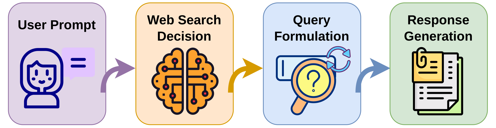

# 🔎 Web Search Tool Calling In AI Chatbots

This repository studies how modern AI chatbots decide to call Web search tools and how those calls shape the final response.

## 🎯 Motivation

1. AI agents powering chatbots are increasingly relying on tools, particularly Web search.
2. Web search is a complex task:
   - deciding when parametric knowledge is enough vs. when a tool should be called,
   - formulating search queries from user intent,
   - reformulating queries as new evidence is retrieved,
   - generating final responses grounded in both model knowledge and retrieved results.
3. We analyze longitudinal data from four popular chatbot platforms:
   - 🤖 ChatGPT
   - 🟠 Claude
   - ⚡ Grok
   - 🐳 DeepSeek
4. Implications:
   - (a) designers of AI agents,
   - (b) designers of Web search tools for AI agents,
   - (c) end users of chat platforms.

## 🔄 Web Search Life Cycle



## 📂 Repository Layout

- `src/web_search_decision/chatgpt_extraction.py`: parses raw ChatGPT exports into a per-turn summary dataframe.
- `src/web_search_decision/other_platforms_extraction.py`: same, for Claude, Grok, and DeepSeek exports (and, via the same generic pipeline, ChatGPT too).
- `src/utils/chatgpt_conversation_utils.py` / `src/utils/other_platforms_parsing_utils.py`: the conversation-tree parsing and topic-lookup helpers the two extraction modules above build on.
- `src/utils/common_io.py`: shared path constants and JSON read/write helpers.
- `src/utils/topic_classifier.py`: dependency-free keyword-based topic classification, used when no topic-annotation file is available (see "Pipeline Order & Known Gaps" below).
- `src/web_search_decision/web_tool_invocation.py`: analyses focused on Web-call decisions and trends.
- `src/web_search_decision/claim_analysis.py`: claim-level comparison between Web and no-Web responses.
- `src/query_formulation/query_reformulations.py`: query evolution and reformulation analyses.
- `src/response_generation/source_selection.py`: retrieved/cited source analyses.
- `src/response_generation/response_generation.py`: response grounding and quality analyses.
- `src/response_generation/hallucinated_url_detection.py`: checks cited URLs for reachability/hallucination.
- `src/replays/chat_replayer.py` / `src/replays/chat_replayer_evaluation.py`: invitro replay (re-querying prompts via platform APIs) and LLM-judge scoring of the replayed responses.
- `src/replays/extract_replay_artifacts.py`: post-processes replay outputs into the artifacts/plots used across the analyses above.
- `src/prompts/evaluator_prompts.py`: prompt templates used by the LLM-judge evaluations.
- `src/utils/figure_style.py`: shared Plotly styling for figures.
- `outputs/`: generated analysis artifacts.
- `data/`: your local copies of exported chat data (see below).

## ⚙️ Setup

This project uses Python and common data-science dependencies, including test
tooling (pytest), all listed in `requirements.txt`. A virtual environment keeps
these isolated from anything else on your machine:

```bash
python3 -m venv .venv
source .venv/bin/activate   # Windows: .venv\Scripts\activate
pip install -r requirements.txt
```

One-time extras some modules need at runtime:

```bash
# response_generation.py scrapes cited URLs via Playwright
playwright install chromium

# query_reformulations.py tokenizes text with NLTK
python -m nltk.downloader punkt punkt_tab
```

🔑 Fill in your keys in `.env` (already in the repo, with placeholders for the API
keys and every optional override alongside its built-in default):

```bash
OPENAI_API_KEY=...       # LLM-judge evaluations (factuality/completeness/relevance,
                          # claim extraction, entailment, query-specificity, ...) and
                          # invitro replay of OpenAI models
ANTHROPIC_API_KEY=...    # invitro replay of Claude models
XAI_API_KEY=...          # invitro replay of Grok models
DEEPSEEK_API_KEY=...     # invitro replay of DeepSeek models
```

Everything above is only needed if you plan to run the LLM-judge evaluations or the
invitro replay (`src/replays/chat_replayer.py`). The extraction and descriptive-analysis
scripts work without any API key.

## 📥 Exporting Your Own Data

Because of ERB restrictions we cannot share the original donated dataset (see
**Ethical Considerations** in the paper). To run this pipeline on your own chat
history, request a data export from each platform and drop it under `data/`. Each
platform's export contains **your own conversations only** — nothing donated by
anyone else is required to run the code.

Every platform uses the same layout: `data/<platform>/user_0/conversations.json`.
That's also the `user_<i>/conversations.json` shape all four extraction paths expect
if you ever combine exports from several accounts under the same platform (`user_0`,
`user_1`, ...).

| Platform | Where to export | Raw file you get | Where it goes |
|---|---|---|---|
| 🤖 ChatGPT | Settings → Data controls → Export data (emailed download link) | `conversations.json` | `data/chatgpt/user_0/conversations.json` |
| 🟠 Claude | Settings → Privacy → Export data | `conversations.json` | `data/claude/user_0/conversations.json` |
| 🐳 DeepSeek | Settings → Data export | `conversations.json` | `data/deepseek/user_0/conversations.json` |
| ⚡ Grok | Export your conversation history | `prod-grok-backend.json` | rename to `conversations.json`, then `data/grok/user_0/conversations.json` |

Notes:

- ⚠️ **Grok's export file is not named `conversations.json`** — it comes down as
  `prod-grok-backend.json`. Rename it to `conversations.json` and nest it under
  `user_0/`, e.g.:

  ```bash
  mkdir -p data/grok/user_0
  mv ~/Downloads/prod-grok-backend.json data/grok/user_0/conversations.json
  ```

- Exact export menu wording changes over time and by account type; look for
  "export my data" / "download your data" under each platform's privacy or account
  settings if the paths above have moved.
- 🔒 Exported data can contain personal or sensitive information — treat your
  `data/` and `outputs/` directories as private.

## 🚀 Running The Pipeline / Evaluating Your Data

**1. Extract raw exports into summary dataframes.** This parses the JSON exports
above into per-turn dataframes (`outputs/<platform>/metadata/data_summary.*` and
`web_data_summary.*`, in parquet/pickle/csv):

```bash
python -m src.web_search_decision.chatgpt_extraction                                    # ChatGPT
python -m src.web_search_decision.other_platforms_extraction --platform claude         # Claude
python -m src.web_search_decision.other_platforms_extraction --platform grok           # Grok
python -m src.web_search_decision.other_platforms_extraction --platform deepseek       # DeepSeek
```

Load the results back with:

```python
from src.web_search_decision.chatgpt_extraction import load_whole_data_from_file, load_web_data_from_file

df = load_whole_data_from_file("pkl")
web_df = load_web_data_from_file("pkl")
```

**2. Run the descriptive analyses.** Each of these reads the extracted dataframes
and writes figures/tables under `outputs/<module_name>/`:

```bash
python -m src.web_search_decision.web_tool_invocation     # §3: search-calling decisions & trends
python -m src.query_formulation.query_reformulations      # §4: querying strategies & reformulation
python -m src.response_generation.source_selection        # §4.3/§5.1: retrieved/cited source bias
python -m src.response_generation.response_generation     # §5.2: response grounding & entailment
```

**3. (Optional) invitro replay + LLM-judge evaluation.** To reproduce the
API-based replay and quality scoring (needs the provider API keys above):

```bash
python -m src.replays.chat_replayer               # replay prompts through each platform's API
python -m src.replays.chat_replayer_evaluation    # score replayed responses (factuality/
                                                   # completeness/relevance) with an LLM judge
python -m src.web_search_decision.claim_analysis --help            # claim-level Web vs. no-Web comparison
python -m src.response_generation.hallucinated_url_detection --help  # cited-URL reachability check
```

`src/replays/extract_replay_artifacts.py` is invoked internally by the scripts above to
turn replay output into the artifacts consumed by the analyses in step 2 — you generally
don't need to run it directly.

## 🔗 Pipeline Order & Known Gaps

A few functions across the analysis modules depend on artifacts that either
come from *another* module (run that one first) or don't ship with this
repo at all (a research-only file, or a genuine gap). Worth knowing before
a function fails in a way that isn't obviously about missing data:

- **Topic labels.** `chatgpt_conversation_utils.load_topics()` and
  `other_platforms_parsing_utils.load_topics()` look up each conversation's
  topic from a CSV/JSONL the paper's authors built by hand over their own
  dataset — it won't exist on your checkout. Rather than label everything
  "Other", extraction now falls back to `topic_classifier.classify_topic()`,
  a small dependency-free keyword classifier applied to each conversation's
  opening message.
- **`response_and_sources.pkl`.** `source_selection.py`'s
  `count_unique_retrieved_safe_cited()` (and related functions) read
  `outputs/[<platform>/]metadata/response_and_sources.pkl`, which is
  produced by `response_generation.extract_response_and_sources(web_df)` —
  a *different* module. Run that first. (It's easy to confuse with
  `source_selection.extract_retrieved_safe_cited_source(web_df)`, which
  writes a differently-named file that only feeds functions within
  `source_selection.py` itself.)
- **`all_tools_categorized.json`.** `web_tool_invocation.py`'s Web-call
  trend functions normally read a hand-curated tool-name-to-category
  mapping that also doesn't ship with this repo. They now fall back to
  `_auto_categorize_tool()`, a small heuristic (name contains "web"/
  "search"/"browse", or matches the known Grok/DeepSeek web-tool sets) that
  gives a correct, if coarser, Web-vs-other split instead of silently
  reading 0% everywhere.
- **PII-safety annotations for replay.** `chat_replayer.py`'s
  `filter_df_for_history()`/`replayer()` refuse to run without a
  `personal_presence`/`special_category_presence`-annotated CSV (see
  Appendix C.1 of the paper) — deliberately *not* given a graceful
  fallback, since skipping it would mean sending unscreened personal data
  to external provider APIs.
- **Two known, currently-unfixed issues**, left as-is rather than
  papered over or guessed at:
  - `web_tool_invocation.py`'s `_run_tool_intent_judge()` references
    `SYSTEM_PROMPT_TOOL_INTENT`/`USER_PROMPT_TOOL_INTENT`, which aren't
    defined anywhere in `evaluator_prompts.py` — add them before calling
    `classify_web_call_tool_intent_from_thoughts()`.
  - `web_tool_invocation.py` defines its own `GROK_WEB_TOOLS`/
    `DEEPSEEK_WEB_TOOLS` (used by `_has_web_call_for_platform()`) that are
    much narrower than the canonical sets in `other_platforms_extraction.py`
    (used everywhere else, including extraction itself) — a possible
    under-counting inconsistency, not resolved here since picking which
    heuristic is "correct" is a research-methodology call.

## 📝 Notes

- Raw data paths in some scripts are machine-specific and may require local edits.
- Analysis outputs are written under `outputs/` by default.
