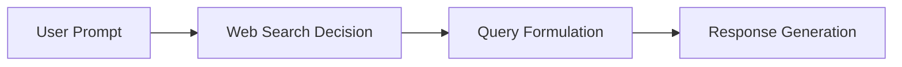

# Web Search Tool Calling In AI Chatbots

This repository studies how modern AI chatbots decide to call Web search tools and how those calls shape the final response.

## Motivation

1. AI agents powering chatbots are increasingly relying on tools, particularly Web search.
2. Web search is a complex task:
   - deciding when parametric knowledge is enough vs. when a tool should be called,
   - formulating search queries from user intent,
   - reformulating queries as new evidence is retrieved,
   - generating final responses grounded in both model knowledge and retrieved results.
3. We analyze longitudinal data from four popular chatbot platforms:
   - ChatGPT
   - Claude
   - Grok
   - DeepSeek
4. Implications:
   - (a) designers of AI agents,
   - (b) designers of Web search tools for AI agents,
   - (c) end users of chat platforms.

## Web Search Life Cycle



## Repository Layout

- `src/data_extraction.py`: parses raw ChatGPT exports into a per-turn summary dataframe.
- `src/data_extraction_other_cai.py` / `src/data_utils_cai.py`: same, for Claude, Grok, and DeepSeek exports.
- `src/data_utils.py` / `src/utils.py`: shared parsing/IO helpers.
- `src/web_tool_invocation.py`: analyses focused on Web-call decisions and trends.
- `src/query_reformulations.py`: query evolution and reformulation analyses.
- `src/source_selection.py`: retrieved/cited source analyses.
- `src/response_generation.py`: response grounding and quality analyses.
- `src/claim_analysis.py`: claim-level comparison between Web and no-Web responses.
- `src/chat_replayer.py` / `src/chat_replayer_evaluation.py`: invitro replay (re-querying prompts via platform APIs) and LLM-judge scoring of the replayed responses.
- `src/extract_replay_artifacts.py`: post-processes replay outputs into the artifacts/plots used across the analyses above.
- `src/run_hallucinated_url_flow_from_pkl.py`: checks cited URLs for reachability/hallucination.
- `src/evaluator_prompts.py`: prompt templates used by the LLM-judge evaluations.
- `src/paper.py`: shared Plotly styling for figures.
- `outputs/`: generated analysis artifacts (gitignored).
- `data/`: your local, unshared copies of exported chat data (gitignored — see below).

## Setup

This project uses Python and common data-science dependencies (see `requirements.txt`; `requirements-dev.txt` adds test tooling).

```bash
pip install -r requirements.txt
# for development/tests:
pip install -r requirements-dev.txt
```

One-time extras some modules need at runtime:

```bash
# response_generation.py scrapes cited URLs via Playwright
playwright install chromium

# query_reformulations.py tokenizes text with NLTK
python -m nltk.downloader punkt punkt_tab
```

Fill in your keys in `.env` (already in the repo, gitignored, with placeholders for
the API keys and every optional override commented out alongside its built-in
default):

```bash
OPENAI_API_KEY=...       # LLM-judge evaluations (factuality/completeness/relevance,
                          # claim extraction, entailment, query-specificity, ...) and
                          # invitro replay of OpenAI models
ANTHROPIC_API_KEY=...    # invitro replay of Claude models
XAI_API_KEY=...          # invitro replay of Grok models
DEEPSEEK_API_KEY=...     # invitro replay of DeepSeek models
```

Everything above is only needed if you plan to run the LLM-judge evaluations or the
invitro replay (`chat_replayer.py`). The extraction and descriptive-analysis scripts
work without any API key.

## Exporting Your Own Data

Because of ERB restrictions we cannot share the original donated dataset (see
**Ethical Considerations** in the paper). To run this pipeline on your own chat
history, request a data export from each platform and drop it under `data/`. Each
platform's export contains **your own conversations only** — nothing donated by
anyone else is required to run the code.

| Platform | Where to export | Raw file you get | Where it goes |
|---|---|---|---|
| ChatGPT | Settings → Data controls → Export data (emailed download link) | `conversations.json` | `data/chatgpt/user_0/conversations.json` |
| Claude | Settings → Privacy → Export data | `conversations.json` | `data/claude/conversations.json` |
| DeepSeek | Settings → Data export | `conversations.json` | `data/deepseek/conversations.json` |
| Grok | Export your conversation history | `prod-grok-backend.json` | rename to `conversations.json`, then `data/grok/conversations.json` |

Notes:

- **Grok's export file is not named `conversations.json`** — it comes down as
  `prod-grok-backend.json`. Just rename it to `conversations.json` before placing it
  in `data/grok/`, e.g.:

  ```bash
  mkdir -p data/grok
  mv ~/Downloads/prod-grok-backend.json data/grok/conversations.json
  ```

- **ChatGPT is nested one level deeper** (`data/chatgpt/user_<i>/conversations.json`)
  than the other three platforms, which read a flat `data/<platform>/conversations.json`.
  This lets `data_extraction_other_cai.py` also support a multi-user layout
  (`data/<platform>/user_<i>/conversations.json`) if you're combining exports from
  several accounts — ChatGPT extraction always expects the per-user form.
- Exact export menu wording changes over time and by account type; look for
  "export my data" / "download your data" under each platform's privacy or account
  settings if the paths above have moved.
- Exported data can contain personal or sensitive information. Treat your `data/`
  and `outputs/` directories accordingly — both are gitignored by default so they
  won't be committed accidentally.

## Running The Pipeline / Evaluating Your Data

**1. Extract raw exports into summary dataframes.** This parses the JSON exports
above into per-turn dataframes (`outputs/<platform>/metadata/data_summary.*` and
`web_data_summary.*`, in parquet/pickle/csv):

```bash
python -m src.data_extraction                                    # ChatGPT
python -m src.data_extraction_other_cai --platform claude         # Claude
python -m src.data_extraction_other_cai --platform grok           # Grok
python -m src.data_extraction_other_cai --platform deepseek       # DeepSeek
```

Load the results back with:

```python
from src.data_extraction import load_whole_data_from_file, load_web_data_from_file

df = load_whole_data_from_file("pkl")
web_df = load_web_data_from_file("pkl")
```

**2. Run the descriptive analyses.** Each of these reads the extracted dataframes
and writes figures/tables under `outputs/<module_name>/`:

```bash
python -m src.web_tool_invocation     # §3: search-calling decisions & trends
python -m src.query_reformulations    # §4: querying strategies & reformulation
python -m src.source_selection        # §4.3/§5.1: retrieved/cited source bias
python -m src.response_generation     # §5.2: response grounding & entailment
```

**3. (Optional) invitro replay + LLM-judge evaluation.** To reproduce the
API-based replay and quality scoring (needs the provider API keys above):

```bash
python -m src.chat_replayer               # replay prompts through each platform's API
python -m src.chat_replayer_evaluation    # score replayed responses (factuality/
                                           # completeness/relevance) with an LLM judge
python -m src.claim_analysis --help       # claim-level Web vs. no-Web comparison
python -m src.run_hallucinated_url_flow_from_pkl --help  # cited-URL reachability check
```

`src/extract_replay_artifacts.py` is invoked internally by the scripts above to turn
replay output into the artifacts consumed by the analyses in step 2 — you generally
don't need to run it directly.

## Notes

- Raw data paths in some scripts are machine-specific and may require local edits.
- Analysis outputs are written under `outputs/` by default.
